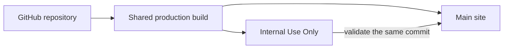
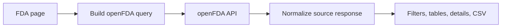
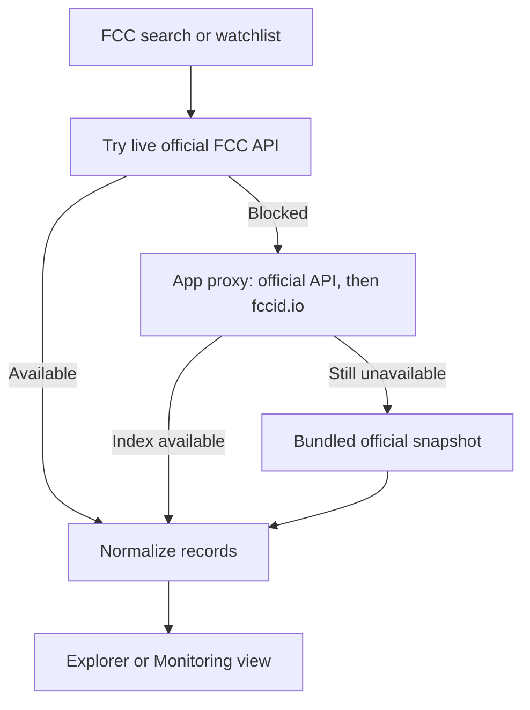

# Sonova Regulatory Data Hub

One workspace for searching and monitoring public FDA medical-device records, FCC equipment authorizations, Health Canada MDALL licences, and IECEE CB Scheme certificates.


## 📖 New here? Never touched code?

**Start with [The Friendly Guide](guide/README.md)** — a short, plain-English book that explains what this website does and how it's built, step by step, assuming zero technical background. It covers what a website even is, where the data comes from, what all the files in this repository are for, and how the site gets onto the internet. About 45 minutes, no jargon left unexplained.

Everything below this point is the quicker, more technical reference for people who already write code.

## Start here

| I want to… | Go here |
| --- | --- |
| Understand this project from zero | [The Friendly Guide](guide/README.md) |
| Use the stable website | [Main site](https://fda-device-index.pages.dev/) |
| Review the newest internal version | [Internal Use Only](https://fda-device-internaluseonly.pages.dev/) |
| Run the project locally | [Local setup](#run-it-locally) |
| Understand the code | [Code tour](#code-tour) |
| Understand the regulatory sources | [Data sources](docs/DATA-SOURCES.md) |
| Release a change | [Deployment guide](docs/DEPLOYMENT.md) |

## What the app does

The top navigation has two independent choices:

1. **Source:** FDA, FCC, HC (Health Canada / MDALL), or IECEE (CB Scheme certificates)
2. **View:** Explorer or Monitoring

That creates eight main workflows:

| Workflow | What it is for |
| --- | --- |
| **FDA Explorer** | Search registration and listing records and, on the same page, FDA GUDID device identifiers (UDI): a Devices view with GTINs, product codes and declared premarket submissions, per-company GUDID panels from the company matrix and record drawer, and registration cross-references from each device; filter by product codes (named from FDA's classification, with typos flagged), class, country and role; sort by listing date or expiry; group by company with a codes-held matrix and, with several codes, keep only companies holding **all** of them; jump from a company to its listings; open 510(k), PMA and product-code pages on FDA's site; customize columns; export Excel workbooks; re-run recent searches. |
| **FDA Monitoring** | Review recent 510(k), recall, and adverse-event activity. |
| **FCC Explorer** | Search complete or partial FCC IDs; group results by confirmed grantee; inspect authorization history, exhibits, and evidence. |
| **FCC Monitoring** | Review recent original authorizations and FCC-labelled authorization changes for configured scopes. |
| **HC Explorer** | Search Health Canada MDALL licences, companies, device names, and identifiers. |
| **HC Monitoring** | Review recently issued and ended Canadian medical device licences. |
| **IECEE Explorer** | Search the IECEE CB Scheme certificate index by manufacturer, trademark, model, product or certificate number; narrow by status, product category, standard (any or every selected standard), certification body, trademark and issue date; open the full certificate record with model, ratings, standards with editions, national differences and parties; find a certificate's amendments; export Excel workbooks. |
| **IECEE Monitoring** | Review recently issued certificates, older certificates that IECEE updated, and cancellations or suspensions for a manufacturer, trademark or watch scope. |

Every workflow keeps source links and timestamps visible. FCC views also distinguish official source fields from app-derived labels and preserve the raw FCC record.

## One codebase, two websites

Main and Internal Use Only are not duplicated applications. Both are built from this repository and deployed to separate Cloudflare Pages projects.



The normal release path is:

1. Build and test a commit.
2. Deploy it to Internal Use Only.
3. Verify all FDA, FCC, Health Canada and IECEE routes.
4. Deploy that exact commit to Main.

This keeps the two sites consistent while giving unfinished changes a safe validation target. ([Friendly Guide, Chapter 8](guide/08-how-the-website-goes-live.md) tells this story in plain language.)

## Run it locally

You need Node.js 22.13 or newer and npm. (First time doing this? [Friendly Guide, Chapter 9](guide/09-run-it-on-your-own-computer.md) walks through every step, including installing the tools.)

```bash
git clone https://github.com/ahmedbins/fda_device.git
cd fda_device
npm install
npm run dev
```

Open the local URL printed by the development server.

To validate the complete project:

```bash
npm test
```

That command creates a production build and runs the parsing, provenance, rendering, API-validation, FDA product-code matching, and FDA regression tests.

## Code tour

### 1. Routes stay small

The route files under `app/fda/`, `app/fcc/`, `app/hc/` and `app/iecee/` select shared page components. Most feature code lives in a small number of clearly named modules:

| File | Responsibility |
| --- | --- |
| `app/page.tsx` | FDA Explorer UI, query state, filters, result table, detail panels, and export behavior. |
| `app/monitor-page.tsx` | FDA Monitoring queries and the 510(k), recall, and adverse-event sections. |
| `app/fcc-explorer-page.tsx` | FCC search UI, filters, grouped grantees, authorization dossiers, imports, sharing, and CSV export. |
| `app/fcc-monitor-page.tsx` | FCC watchlists, date windows, activity summaries, authorization tables, and change categories. |
| `app/mdall-explorer-page.tsx` | Health Canada MDALL search, licence dossiers, company profiles, and CSV export. |
| `app/mdall-monitor-page.tsx` | Health Canada watchlists and recent issued/ended licences. |
| `app/iecee-explorer-page.tsx` | IECEE certificate search UI, facet filters, certificate drawer, certificate families, and Excel export. |
| `app/iecee-monitor-page.tsx` | IECEE watch scopes, date windows, issued/updated/cancelled certificate tables. |
| `app/source-nav.tsx` | Shared FDA/FCC/HC/IECEE and Explorer/Monitoring navigation. |
| `app/explorer-tools.tsx` | Shared explorer tools: sortable and resizable table headers with widths remembered per device, applied-filter chips, and recent searches (used by every Explorer). |
| `app/globals.css` | Shared responsive visual system for every route. |

### 2. Data logic is separate from the UI

The page components do not need to understand every source-specific detail:

| File | Responsibility |
| --- | --- |
| `app/fda-udi.ts` | openFDA UDI (GUDID) types, normalization, device-level ANY/ALL queries, labeler/listing cross-reference queries. |
| `app/fda-udi-panel.tsx` | Per-company GUDID summary panel (server-side counts + newest devices) and the full device detail with registration cross-reference. |
| `app/fda-shared.ts` | FDA constants, the openFDA query builder, ANY/ALL product-code matching, company + devices grouping, URL filter state, the 404-as-empty openFDA fetch helper, and export utilities shared by FDA views. |
| `app/fcc-core.ts` | FCC XML/JSON parsing, date normalization, conservative purpose mapping, confirmed ID-part derivation, deduplication, grouping, and monitoring windows. |
| `app/fcc-service.ts` | Orchestrates the FCC snapshot, live request, server proxy, cache, grantee registry, and manual official-response import. |
| `app/fcc-config.ts` | Explicitly confirmed FCC presets and watchlist scopes. |
| `app/fcc-official-snapshot.ts` | Exact provenance-labelled FCC EAS records used for reliable covered-scope startup. |
| `app/mdall-core.ts` | Health Canada MDALL normalization, status labels, and grouping. |
| `app/mdall-service.ts` | Official MDALL API search, company joins, and device lookup. |
| `app/iecee-core.ts` | IECEE search-body builder, response parsing (results, facets, primary/secondary searches), certificate and detail normalization, URL state, certificate families. |
| `app/iecee-service.ts` | IECEE searches, certificate records, trademark suggestions and export paging through the same-origin relay. |
| `app/iecee-relay.ts` | Validation shared by every IECEE relay: only the official search shape is forwarded upstream. |
| `app/iecee-config.ts` | IECEE presets (plain text searches, not ownership lookups). |
| `app/api/fcc/search/route.ts` | Server-side FCC proxy used by the full-stack build when the upstream service permits it. |
| `app/api/iecee/*/route.ts` | Server-side IECEE relay routes for the full-stack build (`public/_worker.js` serves the same routes on Cloudflare Pages). |

The separation matters: parsing and source rules can be tested without rendering React, while UI work can consume one normalized record shape.

### 3. FDA request flow



FDA Explorer uses the Registration & Listing API. FDA Monitoring uses the 510(k), Recall, and Adverse Event APIs. Requests are made directly from the client to public openFDA endpoints.

### 4. FCC request flow



The FCC endpoint is public, but FCC/Akamai and browser CORS policies can block some automated request modes. The app treats that as a coverage limitation—not evidence that a record does not exist. Confirmed scopes load from the labelled official snapshot, and uncovered scopes can be imported from the official XML/JSON response. ([Friendly Guide, Chapter 6](guide/06-when-a-source-wont-answer.md) explains the reasoning behind this fallback ladder.)

### 5. Two production build paths share the same UI

- `npm run build` creates the full vinext/Worker build.
- `npm run build:pages` creates static multi-route output from `cloudflare-spa/`.
- Both builds import the same page components from `app/`.
- `npm run deploy:internal` sends the static build to the Internal Pages project.
- `npm run deploy:main` sends the same build to the Main Pages project.

## Project structure

```text
app/
  api/fcc/search/        FCC server-proxy route
  api/iecee/             IECEE relay routes (search, certificate, trademarks)
  fda/                   FDA route entry points
  fcc/                   FCC route entry points
  hc/                    Health Canada MDALL route entry points
  iecee/                 IECEE certificate route entry points
  *-page.tsx             Shared Explorer and Monitoring page components
  fda-shared.ts          FDA helpers
  fcc-core.ts            FCC parsing and normalization
  fcc-service.ts         FCC source orchestration
  iecee-*.ts             IECEE core, relay rules, service and presets
cloudflare-spa/          Static Pages entry points and Vite configuration
guide/                   The Friendly Guide — plain-English walkthrough of the project
public/                  Icons and social-preview assets
tests/                   Unit, rendered-route, API, and regression tests
worker/                  Full-stack Cloudflare Worker entry point
docs/                    Deeper architecture, provenance, and release guides
```

## Useful commands

| Command | What it does |
| --- | --- |
| `npm run dev` | Start local development. |
| `npm test` | Build and run all automated tests. |
| `npm run build` | Create the full vinext production build. |
| `npm run build:pages` | Create the static Cloudflare Pages build. |
| `npm run deploy:internal` | Build and deploy Internal Use Only. |
| `npm run deploy:main` | Build and deploy Main. |

Cloudflare deployment requires an authenticated Wrangler session with access to the existing Pages projects.

## Regulatory data sources

| Source | Used by |
| --- | --- |
| [openFDA Device Registration & Listing](https://open.fda.gov/apis/device/registrationlisting/) | FDA Explorer |
| [openFDA 510(k)](https://open.fda.gov/apis/device/510k/) | FDA Monitoring |
| [openFDA Device Recall](https://open.fda.gov/apis/device/recall/) | FDA Monitoring |
| [openFDA Device Adverse Events](https://open.fda.gov/apis/device/event/) | FDA Monitoring |
| [FCC Equipment Authorization System](https://apps.fcc.gov/OETLabServices/getFCCIDList?fccId=KWC) | FCC Explorer and Monitoring |
| [FCC Open Data grantee registrations](https://opendata.fcc.gov/Engineering-Technology/EAS-Equipment-Authorization-Grantee-Registrations/3b3k-34jp) | Confirmed FCC grantee profiles |
| [Health Canada MDALL API](https://health-products.canada.ca/api/documentation/mdall-documentation-en.html) | HC Explorer and Monitoring |
| [IECEE CB Scheme certificate search](https://certificates.iecee.org/) (`ocs-iecee-api.iecee.org/api/search-es`, relayed same-origin) | IECEE Explorer and Monitoring |
| [Canada Gazette Parts I, II and III](https://gazette.gc.ca/rp-pr/publications-eng.html) | Canada Gazette intelligence (design preview) |

Read [Data sources and provenance](docs/DATA-SOURCES.md) before changing source mappings, FCC presets, normalized categories, or snapshot records.

## Adding or changing a feature

1. Start in the relevant page component for UI/state behavior.
2. Put reusable source parsing or normalization in `fda-shared.ts` or `fcc-core.ts`.
3. Keep upstream request/fallback logic in `fcc-service.ts` or the relevant FDA page module.
4. Preserve the raw regulatory value and label derived fields.
5. Add a focused test under `tests/`.
6. Run `npm test`.
7. Validate the change on Internal Use Only before promoting the same commit to Main.

## More documentation

- [The Friendly Guide](guide/README.md) — plain-English, step-by-step walkthrough for non-developers
- [Architecture](docs/ARCHITECTURE.md)
- [Data sources and provenance](docs/DATA-SOURCES.md)
- [Deployment and promotion](docs/DEPLOYMENT.md)
- [Contributing](CONTRIBUTING.md)

## Security and accuracy

- Never commit access tokens, Cloudflare credentials, `.env` files, cookies, or private session data.
- Do not treat the Internal Use Only hostname as an authentication boundary.
- Do not invent missing regulatory fields or corporate relationships.
- Keep FCC-reported wording visible when showing a normalized category.
- Verify material regulatory decisions against the linked official record.
