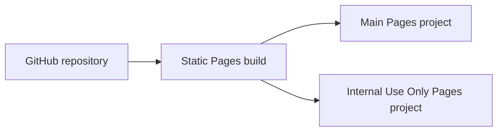
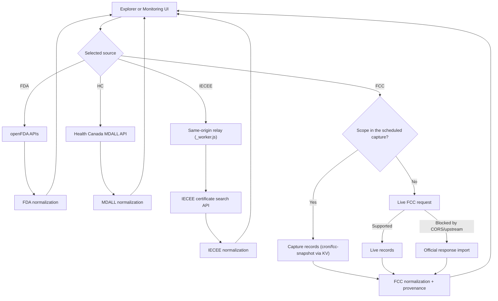

# Architecture

## One application, two Pages deployments

Main and Internal Use Only are two deployments of the same source tree:



There is intentionally no `main-site/` and `internal-site/` duplication. Environment-specific behavior is limited to the deployment command and hosting access policy. UI, routes, data normalization, tests, and assets are shared.

## Runtime shapes

### Cloudflare Pages: Main and Internal

`cloudflare-spa/vite.config.ts` produces static HTML and JavaScript entry points for all FDA, FCC, Health Canada and IECEE routes. Both Pages projects deploy the output from `work/cloudflare-pages/`.

- Main project: `fda-device-index`
- Internal project: `fda-device-internaluseonly`
- Client-side FDA requests go directly to openFDA.
- Confirmed FCC scopes resolve from the scheduled capture served by `cron/fcc-snapshot` (a Cloudflare Worker with a cron trigger and KV storage) through `/api/fcc/current`; the bundled official copy is the fallback.
- The app attempts the live FCC endpoint for other scopes where the browser supports it.
- Uncovered FCC scopes can be imported from the official FCC XML/JSON response.
- IECEE certificate requests go through `public/_worker.js` (`/api/iecee/search`, `/api/iecee/certificate`, `/api/iecee/trademarks`) because the IECEE API only allows browser requests from certificates.iecee.org; the relay validates the body, strips upstream cookies and caches answers at the edge.

## Route composition

The route files are intentionally small. They select a shared page component:

```text
app/page.tsx                  FDA Explorer implementation
app/monitor-page.tsx          FDA Monitoring implementation
app/fcc-explorer-page.tsx     FCC Explorer implementation
app/fcc-monitor-page.tsx      FCC Monitoring implementation
app/mdall-explorer-page.tsx   Health Canada MDALL Explorer
app/mdall-monitor-page.tsx    Health Canada MDALL Monitoring
app/iecee-explorer-page.tsx  IECEE certificate Explorer
app/iecee-monitor-page.tsx   IECEE certificate Monitoring
app/source-nav.tsx            FDA/FCC/HC/IECEE and Explorer/Monitoring navigation
app/fda-shared.ts             FDA normalization and export helpers
app/fcc-core.ts               FCC parsing, normalization, grouping, provenance
app/fcc-service.ts            FCC snapshot/live/import orchestration
app/fcc-config.ts             Confirmed FCC presets and watchlists
app/fcc-official-snapshot.ts  Provenance-labelled official FCC response (bundled fallback copy)
cron/fcc-snapshot/            Scheduled Worker that captures the confirmed FCC scopes twice a day
app/mdall-core.ts             MDALL parsing, status labels, grouping
app/mdall-service.ts          Official Health Canada MDALL API orchestration
app/mdall-config.ts           Confirmed MDALL company watchlists
app/iecee-core.ts             IECEE search body, response/facet parsing, normalization, URL state
app/iecee-service.ts          IECEE relay client: searches, certificate records, export paging
app/iecee-relay.ts            IECEE relay validation shared by worker, dev middleware and routes
app/iecee-config.ts           IECEE presets (text searches)
```

## Data flow



## FCC record model

The FCC model deliberately separates source facts from derived values:

- FCC-reported: FCC ID, grantee name, grant date, application purpose, address and location.
- Derived only from confirmed configuration: grantee-code component, product-code component, normalized activity category.
- Provenance: source mode, snapshot capture time, app retrieval time, exact official-source URL, raw source object.

Equipment descriptions, RF characteristics, and equipment class are not invented when the implemented FCC endpoint does not return them.

## State and persistence

- Explorer filters and Monitoring scopes are reflected in the URL for sharing and repeatability (FDA Explorer includes `match=all` when the Company + devices view should keep only companies covering every selected code).
- Column preferences use browser local storage.
- Imported FCC responses remain in the current browser session.
- No database-backed snapshot comparison is enabled. Monitoring reports activity based on FCC grant dates and does not claim snapshot-delta detection.

## Testing

`npm test` performs a production build and runs Node tests covering:

- FCC scope and date normalization;
- official XML parsing;
- confirmed grantee-code derivation;
- FCC purpose normalization while preserving raw wording;
- official snapshot records and manual imports;
- grouped grantee behavior;
- route server rendering;
- FDA company-level ANY/ALL product-code matching, openFDA query building and URL filter state;
- FDA GUDID (UDI) normalization, device-level ANY/ALL queries and registration cross-reference queries;
- FDA Explorer and Monitoring regression checks;
- API input validation.
