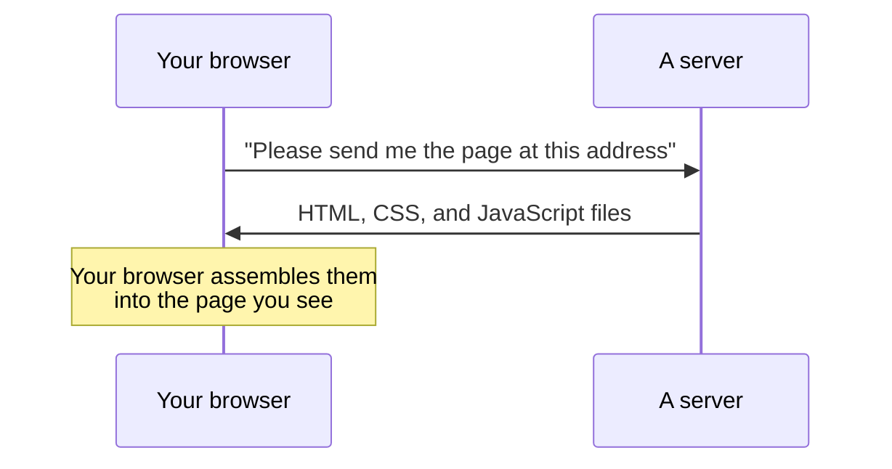

# Chapter 2: What a website is made of

*[← Chapter 1](01-what-this-website-does.md) · [Guide home](README.md) · [Next: Where the data comes from →](03-where-the-data-comes-from.md)*

---

This chapter has nothing specific to our project in it. It's the ten-minute version of "how websites work," and once you have it, everything else in this guide will click into place.

## A website is files

When you visit a website, your browser (Chrome, Safari, Edge…) downloads a handful of files from another computer and displays them. That's the whole trick. Three kinds of files do the work:

- **HTML** — the *content and structure*. "There is a heading here, a search box below it, and a table under that." If a web page were a house, HTML is the walls and rooms.
- **CSS** — the *appearance*. "Headings are dark blue, the table has thin grey lines, on a phone the columns stack vertically." CSS is the paint, furniture, and lighting.
- **JavaScript** — the *behavior*. "When the user clicks Search, go fetch the results and put them in the table." JavaScript is the electricity and plumbing — the part that makes the house *do* things.

Every website you have ever used is some combination of these three.

## A server is just a computer that answers

The files have to come from somewhere. A **server** is a computer, running somewhere in the world, whose job is to hand out files (or answers) when asked. When you type an address into your browser:

"The cloud" is a marketing word for "someone else's servers." Our site's files are handed out by **Cloudflare**, a company with servers all over the world, so the site loads quickly wherever you are. More on that in Chapter 8.

## Where does the *data* come from, then?

Here's the key idea for understanding our site. The files above are the *empty* application — the search box, the table with no rows in it, the logic for what to do when you click. The actual regulatory records are **not** stored in those files.

Instead, when you run a search, the JavaScript running in *your* browser sends a question directly to the *government's* servers and displays whatever they answer. The next chapter is entirely about how that conversation works.

This design has a name — a **static site** — and it has a nice property: since we never copy the government's database, we can't have a stale or corrupted copy of it. What you see is what the government's own servers said, moments ago.

## Two helpers you'll hear about

Two more terms appear throughout this project, so let's demystify them now:

- **React** — Writing raw HTML and JavaScript for a complicated page (six screens, dozens of filters, tables that update live) gets messy fast. React is a widely used toolkit that lets developers describe a page as a set of reusable **components** — "a search box," "a results table," "a detail panel" — and it keeps the screen in sync with the data automatically. Most large websites you use daily are built with React or something like it.

- **TypeScript** — JavaScript with seatbelts. Plain JavaScript will happily let you write "take the licence number and multiply it by a company name," and you only find out it's nonsense when the page breaks. TypeScript lets developers declare what shape each piece of data has ("a licence record has a number, a status, and a date"), and it refuses to build the site if any code mismatches those shapes. For a project where data accuracy is the whole point, those seatbelts matter. You'll see file names ending in `.ts` and `.tsx` — that's TypeScript.

## One sentence to remember

> Our website is a bundle of HTML, CSS, and JavaScript files, handed out by Cloudflare's servers, that runs in your browser and asks government servers questions on your behalf.

Everything in the rest of this guide is detail on top of that sentence.

---

*[← Chapter 1](01-what-this-website-does.md) · [Guide home](README.md) · [Next: Where the data comes from →](03-where-the-data-comes-from.md)*
