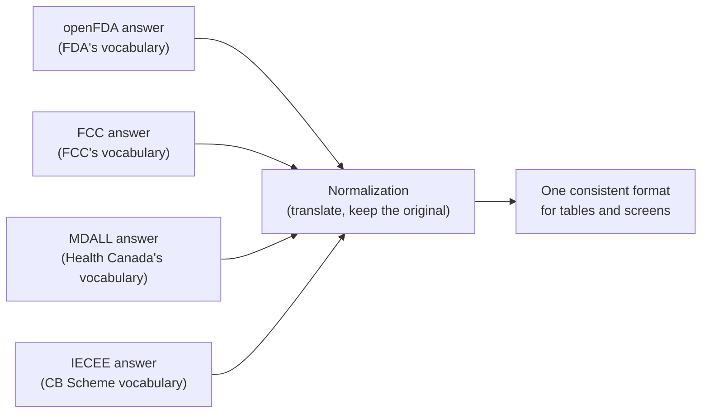

# Chapter 3: Where the data comes from

*[← Chapter 2](02-what-a-website-is-made-of.md) · [Guide home](README.md) · [Next: A tour of the project folders →](04-a-tour-of-the-project-folders.md)*

---

## What an API is

Government agencies publish their records in two ways. The first is a website for humans: a search form you fill in, a results page you read. The second is an **API** — a way for *programs* to ask the same questions and get the answers back as structured data instead of a formatted page.

API stands for "Application Programming Interface," but forget the acronym. Think of it as a **service window**. A human walks into the records office and browses the shelves; a program goes to the service window, hands over a precisely worded request slip, and receives a precisely formatted answer.

A request to an API is literally just a web address. Here is a real one:

```
https://api.fda.gov/device/510k.json?search=applicant:"Sonova"
```

Reading it left to right: "Dear FDA server, from your device 510(k) records, find the ones where the applicant is Sonova." You can paste that into a browser yourself. What comes back isn't a pretty page — it's raw structured data, in a format called **JSON**, which looks like this:

```json
{
  "applicant": "Sonova USA Inc.",
  "device_name": "Hearing aid",
  "decision_date": "2025-11-04"
}
```

Labels and values, in curly braces. Not made for human eyes — made to be effortless for a program to pick apart. Our site's entire job is: build request slips like that from what you type, hand them to the right service window, and turn the JSON that comes back into readable tables.

## Our three sources

### 1. openFDA (United States — medical devices)

The FDA runs a public API service called **openFDA**. We use four of its record collections:

| Collection | What's in it | Where it appears on our site |
| --- | --- | --- |
| Registration & Listing | Which facilities are registered to make devices, and which devices they list | FDA Explorer |
| 510(k) | Clearance decisions — the FDA's green light to market a device | FDA Monitoring |
| Recalls | Devices pulled back or corrected due to problems | FDA Monitoring |
| Adverse Events | Reports of malfunctions or harm involving a device | FDA Monitoring |

openFDA is well-documented and happy to answer browsers directly, so this is our most straightforward source.

### 2. FCC Equipment Authorization System (United States — radio devices)

Every product that transmits radio signals in the US gets an **FCC ID** — you've seen these codes on the back of your electronics. The ID has two parts: a **grantee code** identifying the company (Sonova USA's is `KWC`) and a product code chosen by the company.

The FCC has a public lookup that, given an ID or the start of one, returns every matching authorization. It works — but with quirks that gave us real engineering headaches. The FCC's servers sometimes answer a human's browser but refuse the same question when a program asks it. Chapter 6 is entirely about how we deal with that honestly.

### 3. Health Canada MDALL (Canada — medical devices)

Health Canada publishes a clean, documented API for its licence listing. We use it to look up licences, the companies that hold them, and the devices covered by each licence. One wrinkle worth knowing: the API can't answer every question in one step. To find "all licences held by Sonova," the site first asks "what is Sonova's company ID number?" and then asks "what licences belong to company 113080?" — two trips to the service window, stitched together behind the scenes.

### 4. IECEE CB Scheme certificates (worldwide — electrical safety)

The IECEE runs the CB Scheme: a test laboratory in one country tests a product against an IEC standard, and certification bodies elsewhere accept that certificate instead of testing again. Every certificate is listed on a public search site. That site is powered by a search service which, unlike openFDA, only agrees to talk to the IECEE site itself — a browser on our site would be turned away. So the site relays the question through its own address (Chapter 6 explains this trick): the page asks our server, our server asks IECEE, and the answer comes back with the facet counts (how many certificates per status, category, standard and certification body) that the IECEE site uses too.

## Making four vocabularies speak one language

Each agency describes things its own way. The FDA says "applicant," the FCC says "grantee," Health Canada says "licence holder," IECEE says "manufacturer" and "applicant" — all meaning roughly "the company." Dates arrive in different formats. Statuses use different words.

So for each source, the site has a **normalization** step: code whose only job is to translate the source's raw answer into one consistent internal shape that the tables and screens understand. Crucially — remember Chapter 1's rule — normalizing never *replaces* the original. The government's exact wording stays stored on every record and visible in the interface, with our simplified label alongside it.



## What we deliberately do NOT do

- We don't store a copy of the government databases. Searches go to the live sources (with one carefully labelled exception, explained in Chapter 6).
- We don't guess. If a source doesn't state a device's category, company relationship, or technical characteristic, the site leaves it blank rather than inferring it.
- We don't hide our tracks. Every record links to its official source, and the site tells you which source answered and when.

---

*[← Chapter 2](02-what-a-website-is-made-of.md) · [Guide home](README.md) · [Next: A tour of the project folders →](04-a-tour-of-the-project-folders.md)*
