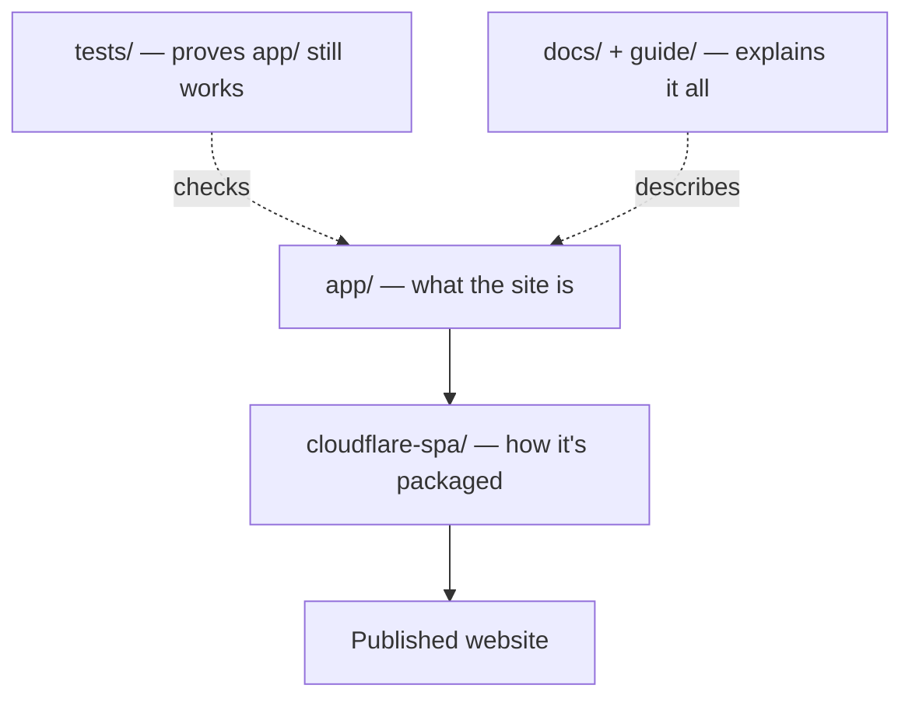

# Chapter 4: A tour of the project folders

*[← Chapter 3](03-where-the-data-comes-from.md) · [Guide home](README.md) · [Next: The journey of a search →](05-the-journey-of-a-search.md)*

---

## First, what is "this repository"?

The page you're reading lives on **GitHub**, a website where people store and share code projects. A project stored there is called a **repository** (or "repo"). Beyond storage, GitHub keeps the project's entire history: every change ever made, when, and why — using a tool called **Git**. Think of it as a shared folder with a perfect memory and an unlimited undo button.

If you browse the repository's front page, you'll see a list of folders and files. Here's what each one is for, in order of how interesting it is.

## The folders that matter

### `app/` — the application itself

This is the heart of the project. Almost everything the website *does* is described in this folder. The files come in two flavors, and the split is deliberate:

**Screen files** describe what you see. There's roughly one per screen from Chapter 1's grid:

| File | The screen it draws |
| --- | --- |
| `page.tsx` | FDA Explorer |
| `monitor-page.tsx` | FDA Monitoring |
| `fcc-explorer-page.tsx` | FCC Explorer |
| `fcc-monitor-page.tsx` | FCC Monitoring |
| `mdall-explorer-page.tsx` | Health Canada Explorer |
| `mdall-monitor-page.tsx` | Health Canada Monitoring |
| `source-nav.tsx` | The navigation bar shared by all six |
| `globals.css` | The one stylesheet — colors, spacing, layout — for the whole site |

**Data files** know how to talk to the sources and translate their answers (Chapter 3's normalization). For example, `fcc-core.ts` knows how to read the FCC's raw answers, `fcc-service.ts` decides which FCC source to try in which order, and `mdall-service.ts` handles the two-step Health Canada lookups.

Why keep screens and data separate? So each half can change — and be tested — without breaking the other. The person adjusting how a table looks doesn't need to touch the code that parses FCC records, and vice versa. It's the same reason a restaurant separates the dining room from the kitchen.

### `tests/` — the automated safety checks

Small programs that verify the site still works correctly after every change. Chapter 7 explains how these work — they're one of the most reassuring parts of the whole project.

### `docs/` — the technical manuals

Deeper documentation written for developers: the architecture in detail, precise notes on every data source, and the release procedure. This guide is the friendly on-ramp; those are the reference manuals.

### `public/` — images and icons

Files served exactly as-is: the site's icon, the preview image that appears when a link to the site is shared.

### `cloudflare-spa/` and `worker/` — the packaging instructions

These describe how to bundle the `app/` code into the final files that get published to the internet. Same product, packaging department. Chapter 8 covers this.

## Files sitting at the top level

- `README.md` — the repository's front page. (The `.md` means **Markdown**, a simple way of writing formatted text — headings, tables, links — in a plain file. This guide is written in it too.)
- `package.json` — the project's ingredient list and recipe card. It names every piece of third-party code the project uses, and defines short commands like `npm test` ("run all the checks") and `npm run dev` ("start the site on my computer").
- `.gitignore` — tells Git which files *not* to keep in history, like generated build output and private local files.

## Folders you can ignore

`node_modules/` (downloaded third-party code — huge, regenerated on demand, never edited by hand), `dist/` and `work/` (generated build output), and various `.something/` folders (settings for tools). A good rule of thumb in any code project: generated things are disposable; only the source files are precious.

## The mental map

---

*[← Chapter 3](03-where-the-data-comes-from.md) · [Guide home](README.md) · [Next: The journey of a search →](05-the-journey-of-a-search.md)*
