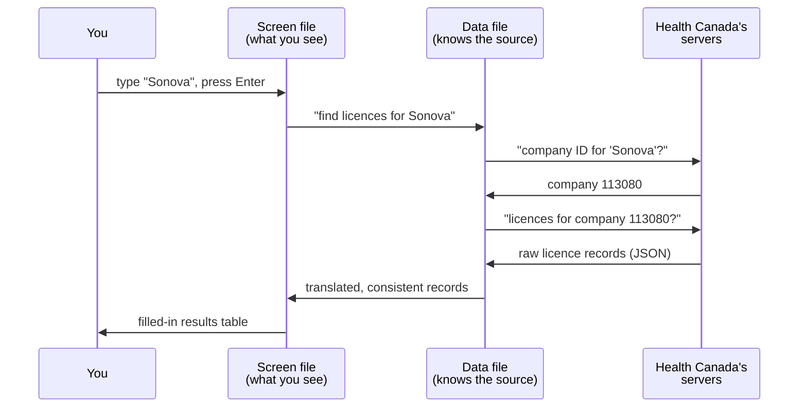

# Chapter 5: The journey of a search

*[← Chapter 4](04-a-tour-of-the-project-folders.md) · [Guide home](README.md) · [Next: When a source won't answer →](06-when-a-source-wont-answer.md)*

---

Let's follow one search from keypress to results table. Say you open the Health Canada Explorer, type **Sonova**, and press Enter. Here's everything that happens in the next second or two.

## Step by step

**1. The screen file notices.** The code behind the Explorer screen (`mdall-explorer-page.tsx`) has been waiting for exactly this. It reads what you typed and immediately shows a loading indicator, so you know something is happening.

**2. The request slip gets written.** The screen doesn't talk to Health Canada itself — it asks the data file (`mdall-service.ts`) to do it. That file knows the two-step dance from Chapter 3: first ask the API "what's the company ID for names matching *Sonova*?", then ask "what licences belong to that company ID?"

**3. The question travels.** Your browser sends those requests across the internet to Health Canada's servers, which look up the answer in their database and send back JSON — the raw structured data format we met in Chapter 3.

**4. The answer gets translated.** The raw records pass through normalization (`mdall-core.ts`): dates get a consistent format, status codes become readable labels, records get grouped by company. The original values stay attached to every record.

**5. The table fills in.** The normalized records flow back to the screen file, and React (Chapter 2's toolkit) redraws the table with the results — company names, licence numbers, statuses, dates — each row linking back to the official source.

## The same journey, everywhere

Every feature on the site is a variation of this loop:

- **FDA Explorer**: your filters become an openFDA request slip; the answer becomes the establishments table.
  - One detail worth knowing: every row openFDA sends back is a single *product listing* — one filing by one establishment, almost always for one product code. So the **Records** view simply shows listings that carry any code you picked. The **Company + devices** view can go one step further: with **All selected codes** on, it keeps only companies whose listings, added together, cover every code you picked. That grouping is something the website works out from the company name on each filing; the FDA data itself never says two filings belong together.
- **Monitoring screens**: the "search" is automatic — "everything in the last N days for the watched companies" — and runs when the page opens.
- **Opening a record's detail panel**: often one more, narrower question to the same source ("give me the devices under this specific licence").
- **CSV export**: no new journey at all — the site takes the translated records already on your screen and writes them into a spreadsheet file (**CSV** is the simplest spreadsheet format; Excel opens it directly).

## Why the middle steps earn their keep

You might wonder why the screen doesn't just call the government API directly — why the relay through data files? Three reasons, all practical:

1. **One translator per source.** Six screens use FDA-flavored or FCC-flavored or Canada-flavored data. Putting each source's quirks in one file means fixing a quirk once, not six times.
2. **Testability.** The translation code can be checked by automated tests without ever drawing a screen (Chapter 7).
3. **Backup plans.** When a source won't answer — which genuinely happens — the data file is the single place that decides what to try next. That story is next.

---

*[← Chapter 4](04-a-tour-of-the-project-folders.md) · [Guide home](README.md) · [Next: When a source won't answer →](06-when-a-source-wont-answer.md)*
