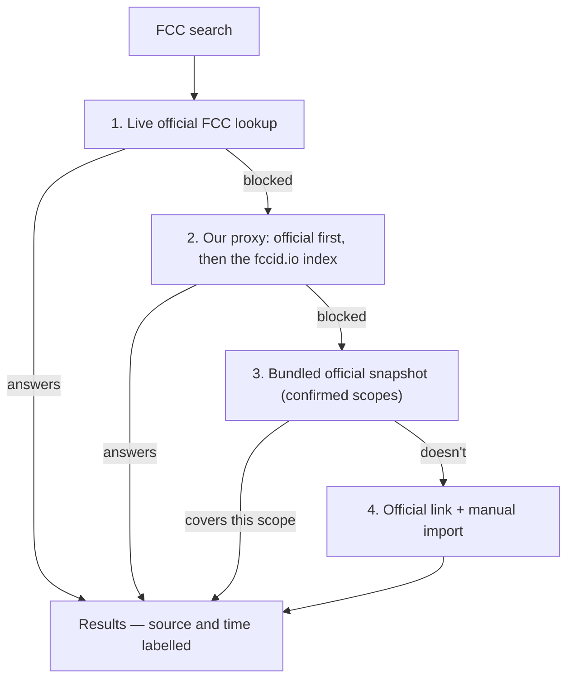

# Chapter 6: When a source won't answer

*[← Chapter 5](05-the-journey-of-a-search.md) · [Guide home](README.md) · [Next: How we know nothing is broken →](07-how-we-know-nothing-is-broken.md)*

---

This chapter tells the story of the hardest engineering problem in the project. It's worth telling in full, because it shows how real software gets built: not by everything working, but by handling what doesn't.

## The FCC problem

The FCC's equipment-authorization lookup is public and free. Open its address in your browser and you get an answer. But when *a program* asks the same question, the FCC's protective systems sometimes refuse.

Two separate gatekeepers cause this:

- **Bot protection.** Like many government sites, the FCC sits behind systems designed to block automated scraping. They can't always tell a legitimate app from an abusive scraper, so they sometimes block both.
- **Browser security rules.** Browsers enforce a rule (called **CORS**) that JavaScript on one website may only fetch data from another website if that other site explicitly says "websites are welcome to ask me." openFDA and Health Canada say it. The FCC's lookup doesn't — so even when the FCC *would* answer, your browser may refuse to let our page ask.

Neither has anything to do with the data itself. The records exist and are public; the service window is just unreliable for programs.

## The wrong answer, and why we rejected it

The tempting fix: when the FCC won't answer, show an empty table. But look at what an empty table *says* to the person reading it: "no authorizations found." For a regulatory tool, that's not a glitch — it's **misinformation**. Someone could conclude a device isn't FCC-authorized when the truth is that we simply couldn't ask.

Chapter 1's rule — never make anything up — cuts both ways. Inventing a record is lying; so is letting silence masquerade as an answer.

## The real answer: a ladder of fallbacks

When you search FCC records, the data file (`fcc-service.ts`) works down a ladder, and the site **always tells you which rung answered**:

**Rung 1 — Ask the FCC directly.** When it works, perfect: live official data.

**Rung 2 — Ask through our proxy.** The site can relay the question through a small server-side helper — sometimes a question refused from a browser succeeds from a server. The proxy tries the official FCC endpoint first, then a public index of FCC filings called fccid.io. That index is a third party, not the FCC — so when it's the rung that answered, the site labels it as such and keeps official FCC links on every record.

**Rung 3 — The bundled snapshot.** For the company scopes this tool exists to watch (Sonova's confirmed FCC grantee codes), the repository carries an exact copy of a real official FCC response, captured on a known date and stored in `fcc-official-snapshot.ts`. If everything live fails, those scopes still show correct official data — clearly labelled as a snapshot, with its capture timestamp.

**Rung 4 — Ask a human to fetch it.** For anything not covered above, the site shows a link to the official FCC lookup (which works fine in a browser, remember) and offers an **import** button: open the link, save what the FCC returns, hand the file to the site, and it parses and displays those records like any others.

## The principle underneath

Every rung preserves the same guarantees: the answer is genuinely from (or traceable to) the official record, the site says *which* rung produced it and *when*, and "we couldn't ask" is never dressed up as "nothing exists." The other two sources rarely need this machinery — but the honesty rules (label the source, show the timestamp, keep official links) apply to every record on the site anyway.

---

*[← Chapter 5](05-the-journey-of-a-search.md) · [Guide home](README.md) · [Next: How we know nothing is broken →](07-how-we-know-nothing-is-broken.md)*
