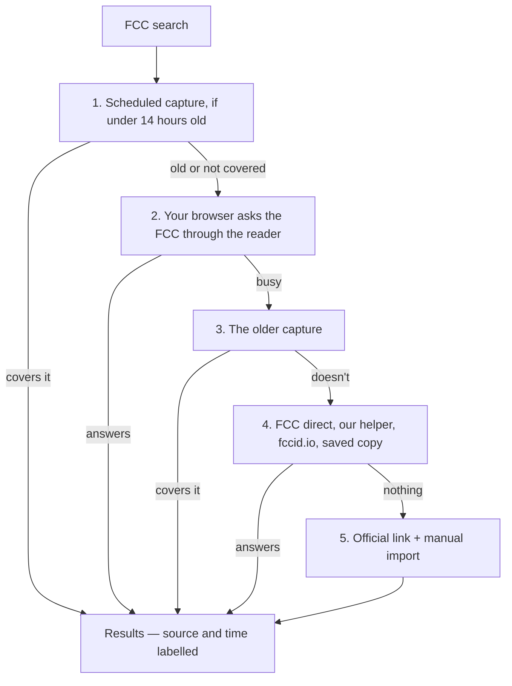

# Chapter 6: When a source won't answer

*[← Chapter 5](05-the-journey-of-a-search.md) · [Guide home](README.md) · [Next: How we know nothing is broken →](07-how-we-know-nothing-is-broken.md)*

---

This chapter tells the story of the hardest engineering problem in the project. It's worth telling in full, because it shows how real software gets built: not by everything working, but by handling what doesn't.

## The FCC problem

The FCC's equipment-authorization lookup is public and free. Open its address in your browser and you get an answer. But when *a program* asks the same question, the FCC's protective systems sometimes refuse.

Two separate gatekeepers cause this:

- **Bot protection.** Like many government sites, the FCC sits behind systems designed to block automated scraping. They can't always tell a legitimate app from an abusive scraper, so they sometimes block both.
- **Browser security rules.** Browsers enforce a rule (called **CORS**) that JavaScript on one website may only fetch data from another website if that other site explicitly says "websites are welcome to ask me." openFDA and Health Canada say it. The FCC's lookup doesn't — so even when the FCC *would* answer, your browser may refuse to let our page ask.

Neither has anything to do with the data itself. The records exist and are public; the service window is just unreliable for programs.

## The wrong answer, and why we rejected it

The tempting fix: when the FCC won't answer, show an empty table. But look at what an empty table *says* to the person reading it: "no authorizations found." For a regulatory tool, that's not a glitch — it's **misinformation**. Someone could conclude a device isn't FCC-authorized when the truth is that we simply couldn't ask.

Chapter 1's rule — never make anything up — cuts both ways. Inventing a record is lying; so is letting silence masquerade as an answer.

## The real answer: a ladder of fallbacks

When you search FCC records, the data file (`fcc-service.ts`) works down a ladder, and the site **always tells you which rung answered**:

**Rung 1 — Our scheduled capture.** For the company scopes this tool exists to watch (Sonova's confirmed FCC grantee codes), a small program on Cloudflare (the "capture Worker", in `cron/fcc-snapshot`) fetches the official FCC records every day and stores them. If that copy is less than 14 hours old, the site uses it: fast, official, and labelled with the time it was captured.

**Rung 2 — Your browser asks through a reader.** The FCC won't answer programs directly, but a public service called r.jina.ai (a "reader") can fetch a web page and pass back exactly what the FCC sent. If the capture is getting old, or you searched for an FCC ID the capture doesn't cover, your own browser asks the reader to fetch the official FCC answer. It's still the FCC's own record, just carried by a messenger.

**Rung 3 — The older capture.** If the reader is busy too, an older official capture still beats nothing, and the site shows its date so you know how old it is.

**Rung 4 — Other routes.** The site then tries the FCC directly (rarely allowed), a small server-side helper that tries the FCC and then a public index of FCC filings called fccid.io (a third party, and labelled as such), and finally an exact copy of a real FCC response kept in the project itself (`fcc-official-snapshot.ts`), labelled with the date it was saved.

**Rung 5 — Ask a human to fetch it.** For anything not covered above, the site shows a link to the official FCC lookup (which works fine in a browser, remember) and offers an **import** button: open the link, save what the FCC returns, hand the file to the site, and it parses and displays those records like any others.

## A real outage, and what it taught us

In September 2026 the capture quietly stopped working for six days. The reader allows each internet address about 20 requests a minute when you don't have an account. Cloudflare runs many customers' programs from the same shared addresses, so by the time our Worker asked, other people's programs had often used up that allowance, and the reader said "too many requests". Because a failed capture never replaces a good one, the site kept showing the last good copy, which was correct but getting older by the day.

Three changes came out of it:

- **Try again, patiently.** The Worker now waits and retries several times over a few minutes, since each try may go out from a different address. It also runs every two hours instead of twice a day, so one bad run is fixed by the next.
- **Share the load with the visitor.** Rung 2 exists because of this outage: each visitor's browser has its own allowance, so the site stays current even when the Worker is stuck.
- **An account key.** With a free reader account, the limit belongs to the key instead of the shared address. The deployment notes explain how to add one.

The lesson is general: when a system depends on someone else's service, check what happens when that service says "not now", and make sure somebody can tell it's happening. The Worker's `/history` page lists what each run tried.

## The principle underneath

Every rung preserves the same guarantees: the answer is genuinely from (or traceable to) the official record, the site says *which* rung produced it and *when*, and "we couldn't ask" is never dressed up as "nothing exists." The other two sources rarely need this machinery — but the honesty rules (label the source, show the timestamp, keep official links) apply to every record on the site anyway.

---

*[← Chapter 5](05-the-journey-of-a-search.md) · [Guide home](README.md) · [Next: How we know nothing is broken →](07-how-we-know-nothing-is-broken.md)*
