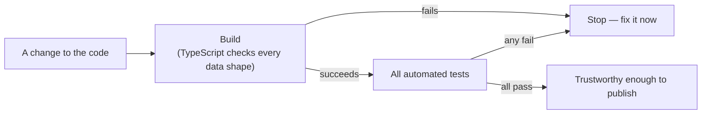

# Chapter 7: How we know nothing is broken

*[← Chapter 6](06-when-a-source-wont-answer.md) · [Guide home](README.md) · [Next: How the website goes live →](08-how-the-website-goes-live.md)*

---

## The fear every software project lives with

Change one thing, break another. You improve the FCC screen, and — without anyone noticing — the date translation used by the Canadian screen stops working. Software is interconnected enough that no human can re-check everything by hand after every change.

The industry's answer is **automated tests**: small programs whose only job is to check that the main program behaves correctly. Each test sets up a situation, runs a piece of the real code, and compares the result against the known right answer. Thousands of checks run in a couple of minutes, the same way every time, without boredom or lapses in attention.

A fair analogy: the checklist a pilot runs before takeoff. Not because the pilot is forgetful, but because a written checklist executed every single time catches what "I'm sure it's fine" misses.

## What our tests actually check

All of them live in the `tests/` folder, and one command — `npm test` — runs every one. They fall into four groups:

**Translation tests.** The biggest group, guarding Chapter 3's normalization. Each takes a saved sample of a real government answer — a real FCC response, a real MDALL record — feeds it to the translation code, and verifies every field comes out right: dates formatted correctly, statuses labelled correctly, the original wording preserved. Remember how the data files were kept separate from the screen files? This is the payoff: these tests run the real parsing logic with no browser and no screen.

**Honesty tests.** These verify the provenance rules from Chapters 1 and 6 — that records keep their source labels, that snapshot data carries its capture time, that derived labels never overwrite official wording. The project's core promise, written down as executable checks.

**Screen tests.** These render each of the six screens the way a browser would and confirm the right elements appear — the navigation, the tables, the source links. They catch the class of mistake where the data is fine but the page fails to show it.

**Request-format tests.** These check that the request slips we write for each API are still well-formed — the right addresses, the right parameter spellings — so a small edit can't quietly turn every search into a failed one.

## The build is a test too

`npm test` actually does something before any test runs: it **builds** the site — fully assembles it for publication. Because the project uses TypeScript (Chapter 2's seatbelts), the build itself refuses to complete if any code mishandles the declared shape of any data. A whole category of mistakes gets caught before a single test needs to run.

## What tests can't do

Honesty requires saying this too: tests only check what someone thought to check. A brand-new kind of mistake, or a government source changing its answer format overnight, can slip past. That's why publishing still involves a human looking at the real site before the main version updates — which is exactly the next chapter.

But the tests transform the *economics* of change. Without them, every improvement risks silent breakage and requires nervous manual re-checking of six screens. With them, a mistake anywhere in the translation, honesty rules, screens, or request formats gets caught in minutes, automatically, before anyone outside the project could ever see it.

## The habit that makes it work

One rule in this project's contributor guidelines ties it together: **when you change behavior, add a test for it.** Each fixed bug gets a test proving it stays fixed; each new feature gets tests pinning down what "working" means. The safety net grows with the project.

---

*[← Chapter 6](06-when-a-source-wont-answer.md) · [Guide home](README.md) · [Next: How the website goes live →](08-how-the-website-goes-live.md)*
