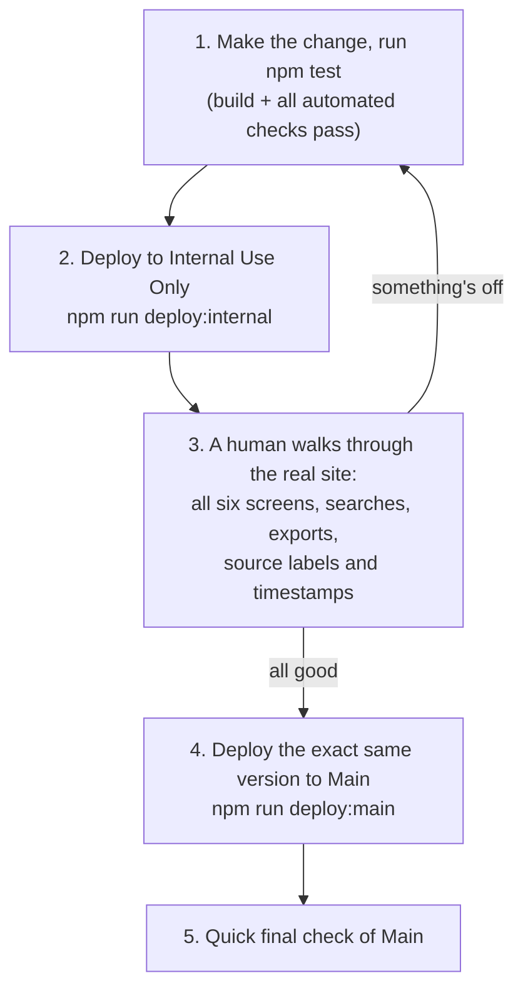

# Chapter 8: How the website goes live

*[← Chapter 7](07-how-we-know-nothing-is-broken.md) · [Guide home](README.md) · [Next: Run it on your own computer →](09-run-it-on-your-own-computer.md)*

---

## From source files to finished files

The files in `app/` are written for *developers* — TypeScript, React components, one big readable stylesheet. Browsers don't run those directly. Before publication, a **build** step translates and packs everything into the plain HTML, CSS, and JavaScript from Chapter 2: TypeScript becomes ordinary JavaScript, the React components get bundled together, and the result is compressed so pages load fast.

Think of `app/` as the recipe and the build as the cooking. The command `npm run build:pages` does the cooking and puts the finished dishes in a folder called `work/cloudflare-pages/`. (This is why that folder is disposable — you can always cook again from the recipe.)

## Where the files are served from

The finished files are uploaded to **Cloudflare Pages**, a hosting service. Cloudflare copies them to its servers around the world, so whoever visits the site gets the files from a server near them. Because our site is static files (Chapter 2) — all the live data comes from the government APIs after the page loads — there's no database of ours to maintain, very little to go wrong at 3 a.m., and hosting like this costs almost nothing.

## Two sites, one recipe

From Chapter 1: there are two copies of the site. Both are built from this repository — the *same* finished files — uploaded to two separate Cloudflare projects:

| Copy | Cloudflare project | Purpose |
| --- | --- | --- |
| **Internal Use Only** | `fda-device-internaluseonly` | Where changes are checked first |
| **Main** | `fda-device-index` | The stable site everyone uses |

There is deliberately **no separate internal codebase**. The only difference between the two deployments is which project name the upload command targets. That's what guarantees "what we tested internally" and "what everyone uses" can be the identical thing.

## The release ritual

Publishing a change follows the same steps every time:

The crucial detail is in step 4: **the exact same version**. Git gives every saved change a unique fingerprint (a **commit**), and the rule is that the fingerprint deployed to Main must be the one that was verified on Internal — no "one tiny extra fix" slipped in between checking and publishing. Tiny unverified fixes are where surprises come from.

## When something goes wrong anyway

Cloudflare keeps every previous deployment of each site. If a bad change reaches Main despite everything, the fix is one click: promote the last known-good deployment, and the site is instantly back to its previous state while the underlying mistake gets fixed calmly. An undo button for the whole website.

## What this chapter and the last one add up to

Chapter 7's tests catch mistakes a machine can catch. This chapter's ritual — rehearse on Internal, verify by hand, promote the identical version, keep an undo — catches the rest. Neither is exotic; both are just the discipline of never letting the main site be the first place a change is seen.

---

*[← Chapter 7](07-how-we-know-nothing-is-broken.md) · [Guide home](README.md) · [Next: Run it on your own computer →](09-run-it-on-your-own-computer.md)*
